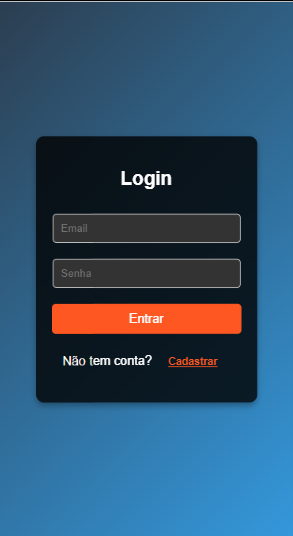
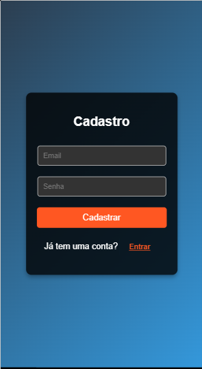
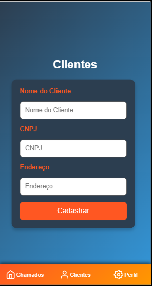
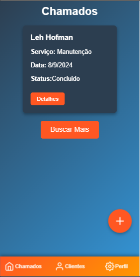
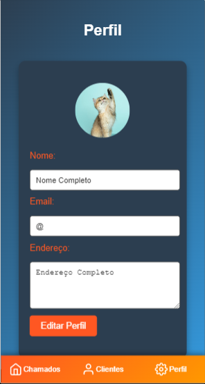

# Sistemas de Chamados

## Sistema de Chamados
O que é o Sistema de Chamados?
O Sistema de Chamados é uma aplicação web inovadora desenvolvida para facilitar a gestão de chamados e a organização de atendimentos. Criado para oferecer uma solução prática e eficiente, o Sistema de Chamados permite que os usuários registrem, gerenciem e acompanhem chamados de forma simples e intuitiva.

Com o Sistema de Chamados, os usuários podem criar novos chamados, editar informações dos chamados existentes, atribuir status, adicionar complementos e gerenciar clientes. A aplicação é equipada com uma interface moderna, projetada para proporcionar uma experiência de usuário agradável e eficiente.

Além das funcionalidades básicas de gestão de chamados, o Sistema de Chamados utiliza armazenamento persistente para garantir que todas as informações inseridas pelos usuários sejam armazenadas de forma segura e estejam sempre disponíveis.

Outro destaque do Sistema de Chamados é seu design responsivo, que se adapta perfeitamente a diferentes tamanhos de tela, oferecendo uma experiência de uso consistente em desktops, tablets e smartphones. Os ícones e botões claros facilitam a navegação e a realização de ações dentro do aplicativo.

Em resumo, o Sistema de Chamados é uma ferramenta essencial para empresas e profissionais que desejam otimizar a gestão de atendimentos e melhorar a eficiência operacional. Com o Sistema de Chamados, você pode reduzir o tempo de resposta, melhorar a qualidade do atendimento e garantir a satisfação dos clientes.

## Telas
<div style="display: flex; justify-content: space-around;">
  
  
  
  
  
</div>

## Funcionalidades

- Adicionar Chamado: Permite ao usuário criar novos chamados, especificando informações como cliente, serviço, status e complemento.
- Editar Chamado: Possibilita a edição de chamados já existentes, permitindo que o usuário atualize as informações conforme necessário.
- Excluir Chamado: O usuário pode remover chamados que não são mais necessários.
- Gerenciar Clientes: Função para adicionar, editar e excluir clientes, garantindo que as informações dos clientes estejam sempre atualizadas.
- Perfil do Usuário: Permite ao usuário visualizar e editar seu perfil, incluindo a troca de imagem de perfil.
- Armazenamento Persistente: Utiliza armazenamento local para garantir que as informações estejam sempre disponíveis, mesmo após fechar o aplicativo.
- Interface Simples: Interface fácil de usar com ícones e botões claros para cada ação.
- Responsividade: Adaptado para diferentes tamanhos de tela, garantindo uma boa experiência tanto em desktops quanto em dispositivos móveis.

## Stack Utilizada

- React.js: Biblioteca JavaScript para construção de interfaces de usuário.
- Styled Components: Biblioteca para estilização de componentes React.
- React Router: Biblioteca para gerenciamento de rotas em aplicações React.
- Firebase: Plataforma para desenvolvimento de aplicativos com funcionalidades de backend.
- Yarn: Gerenciador de dependências.
- VSCode: Editor de código utilizado para o desenvolvimento.

## Como Executar o Projeto

- Pré-requisitos:

  - Node.js
  - Yarn
  - Android 

- Clonar o Repositório:

```
git clone https://github.com/seu-usuario/sistema_de_chamados.git

```

- Abrir com VSCode

- Instale as dependências

```
yarn install

```

- Entre na pasta raiz de seu projeto

```
cd sistema_de_chamados

```

- Setar node

```
set NODE_OPTIONS=--openssl-legacy-provider

```

- Inicie o servidor

```
yarn start

```

- [@octokatherine - Leticia](https://www.github.com/lehhofman)


